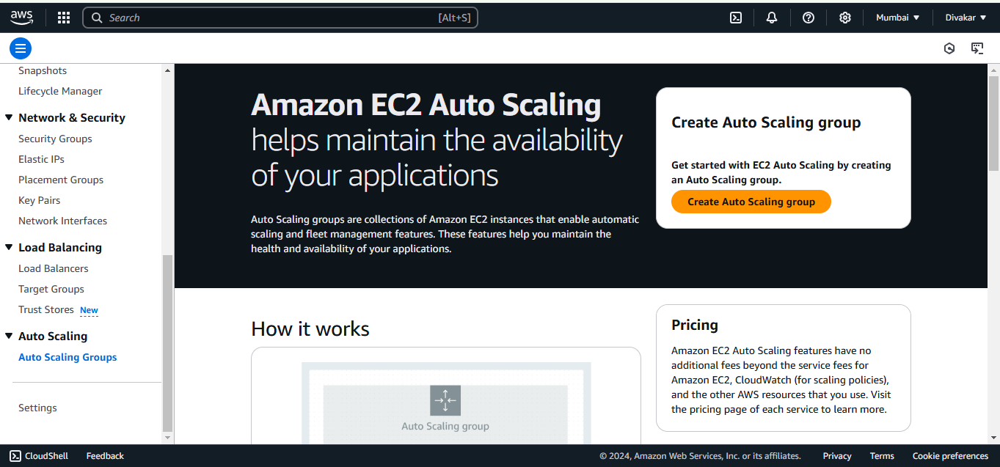
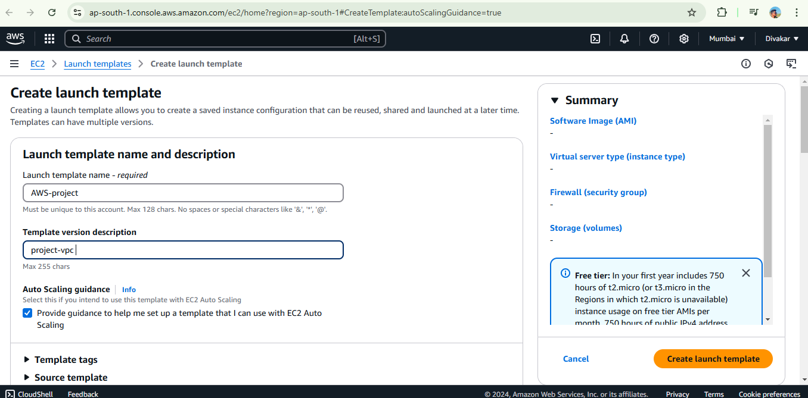
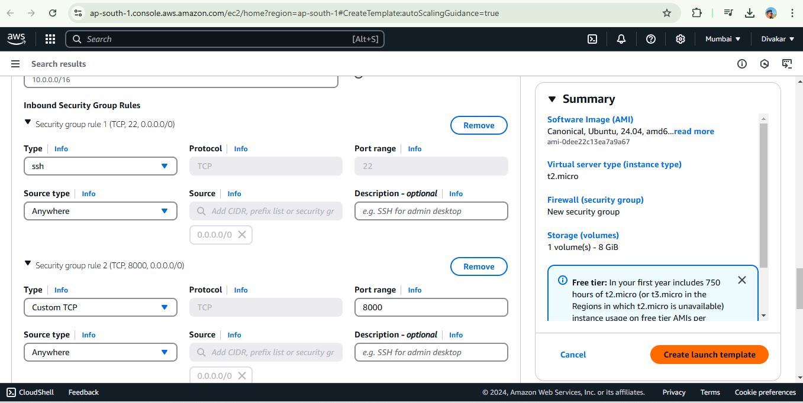
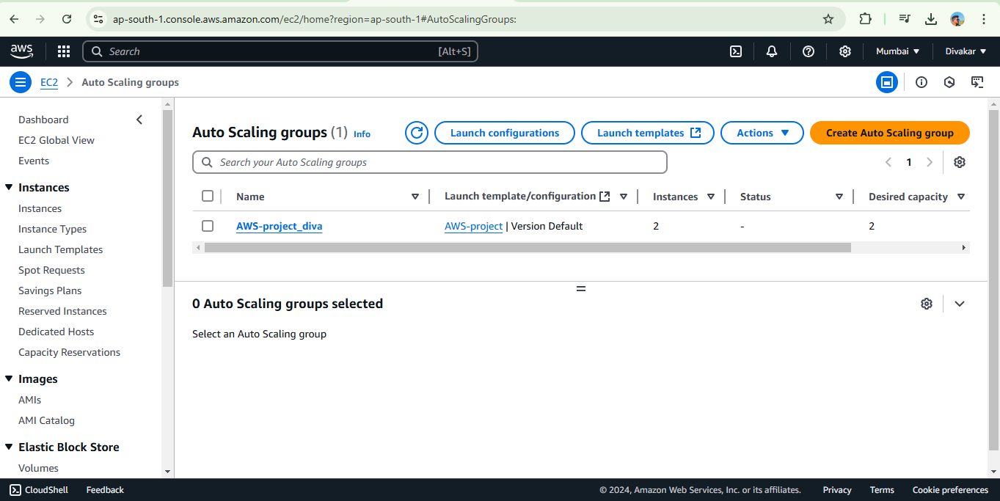

# VPC with servers in private subnets and NAT
## Overview :
In this project, a Virtual Private Cloud (VPC) is designed and implemented on AWS to create a secure and scalable environment for hosting web applications and services. The VPC is segmented into public and private subnets, with specific routing configurations that allow secure communication between the components and the internet.

## Step 1: Create the VPC
1.	Open the Amazon VPC Console: 
    a.	Visit Amazon VPC Console. 
2.	Create a New VPC: 
    a.	On the dashboard, click Create VPC. 
    b.	Under Resources to create, select VPC and more. 

    
3.	Configure the VPC: 
    a.	Provide a name for the VPC in the Name tag auto-generation field. 
    b.	For the IPv4 CIDR block, leave it as the default suggestion (e.g., 10.0.0.0/16). 
4.	Configure Subnets: 
    a.	Set the Number of Availability Zones to 2 for higher availability. 
    b.	Specify the Number of public subnets as 2. 
    c.	Specify the Number of private subnets as 2. 
    d.	For NAT gateways, choose 1 per AZ to ensure high resiliency. 
    e.	Leave VPC endpoints as None unless required. 
    
    f.	For DNS options, ensure the checkbox for Enable DNS hostnames is unchecked. 
5.	Create the VPC: 
    a.	Once you’ve configured all the settings, click Create VPC. 
    
## Step2 : Create an Auto Scaling Group
1.	Navigate to the EC2 Console: 
    a.	Navigate to Services > EC2 under the Compute section. 
2.	Access Auto Scaling Groups: 
    a.	From the left-hand menu, choose Auto Scaling Groups under the Auto Scaling section. 
    b.	Click on the Create Auto Scaling Group button. 
    
3.	Create a Launch Template: 
    a.	Click the Create Launch Template button. 
    b.	Provide a Name and Description for your launch template. 
    
    c.	Select a ubuntu AMI (Ubuntu Image). 
    d.	Choose a free-tier eligible instance type (e.g., t2.micro). 
    e.	Select an existing Key Pair or create a new one (ensure you have access to this key). 
4.	Create a Security Group: 
    a.	Click on Create Security Group and provide a Name and Description for it. 
    
5.	Configure Security Group Rules: 
    o	Inbound Rules: 
        	Type: SSH, Protocol: TCP, Port Range: 22, Source: Anywhere (IPv4). 
        	Type: All TCP, Protocol: TCP, Port Range: All, Source: Anywhere (IPv4). 
    
    o	Outbound Rules: 
        	Type: All Traffic, Protocol: All, Port Range: All, Destination: Anywhere (IPv4). 
    o	Click Create Security Group to finalize. 
6.	Save the Launch Template: 
    a.	Once all the configurations (AMI, instance type, key pair, and security group) are complete, click Create Launch Template to save your settings. 
7.	Configure Auto Scaling Group Settings: 
    a.	Back in the Auto Scaling Group creation page, select the pre-created Launch Template. 
    
    b.	Choose the VPC where your instances will run. 
    c.	Select private subnets in the VPC (preferably across multiple Availability Zones for high availability). 
    
8.	Define Scaling Parameters: 
    a.	Minimum Capacity: Set the minimum number of instances (e.g., 2). 
    b.	Maximum Capacity: Set the maximum number of instances (e.g., 4). 
    c.	Desired Capacity: Set the initial number of instances (e.g., 2). 
9.	Finalize the Auto Scaling Group: 
    a.	Review your configuration and make any necessary adjustments. 
    b.	Click Create Auto Scaling Group to complete the setup. 
    
