# VPC with servers in private subnets and NAT
## Overview :
In this project, a Virtual Private Cloud (VPC) is designed and implemented on AWS to create a secure and scalable environment for hosting web applications and services. The VPC is segmented into public and private subnets, with specific routing configurations that allow secure communication between the components and the internet.

## Step 1: Create the VPC
1.	Open the Amazon VPC Console: 
    a.	Visit Amazon VPC Console. 
2.	Create a New VPC: 
    a.	On the dashboard, click Create VPC. 
    b.	Under Resources to create, select VPC and more. 

    
3.	Configure the VPC: 
    a.	Provide a name for the VPC in the Name tag auto-generation field. 
    b.	For the IPv4 CIDR block, leave it as the default suggestion (e.g., 10.0.0.0/16). 
4.	Configure Subnets: 
    a.	Set the Number of Availability Zones to 2 for higher availability. 
    b.	Specify the Number of public subnets as 2. 
    c.	Specify the Number of private subnets as 2. 
    d.	For NAT gateways, choose 1 per AZ to ensure high resiliency. 
    e.	Leave VPC endpoints as None unless required. 
    
    f.	For DNS options, ensure the checkbox for Enable DNS hostnames is unchecked. 
5.	Create the VPC: 
    a.	Once you’ve configured all the settings, click Create VPC. 
    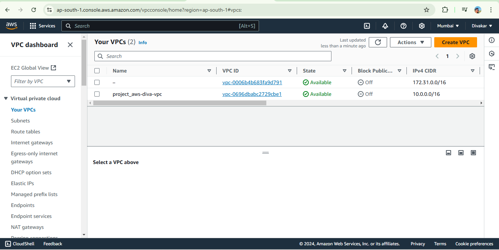
## Step2 : Create an Auto Scaling Group
1.	Navigate to the EC2 Console: 
    a.	Navigate to Services > EC2 under the Compute section. 
2.	Access Auto Scaling Groups: 
    a.	From the left-hand menu, choose Auto Scaling Groups under the Auto Scaling section. 
    b.	Click on the Create Auto Scaling Group button. 
    
3.	Create a Launch Template: 
    a.	Click the Create Launch Template button. 
    b.	Provide a Name and Description for your launch template. 
    
    c.	Select a Amazon Machine Image AMI (Ubuntu Image). 
    d.	Choose a free-tier eligible instance type (e.g., t2.micro). 
    e.	Select an existing Key Pair or create a new one (ensure you have access to this key). 
4.	Create a Security Group: 
    a.	Click on Create Security Group and provide a Name and Description for it. 
    
5.	Configure Security Group Rules: 
    o	Inbound Rules: 
        	Type: SSH, Protocol: TCP, Port Range: 22, Source: Anywhere (IPv4). 
        	Type: All TCP, Protocol: TCP, Port Range: All, Source: Anywhere (IPv4). 
    
    o	Outbound Rules: 
        	Type: All Traffic, Protocol: All, Port Range: All, Destination: Anywhere (IPv4). 
    o	Click Create Security Group to finalize. 
6.	Save the Launch Template: 
    a.	Once all the configurations (AMI, instance type, key pair, and security group) are complete, click Create Launch Template to save your settings. 
7.	Configure Auto Scaling Group Settings: 
    a.	Back in the Auto Scaling Group creation page, select the pre-created Launch Template. 
    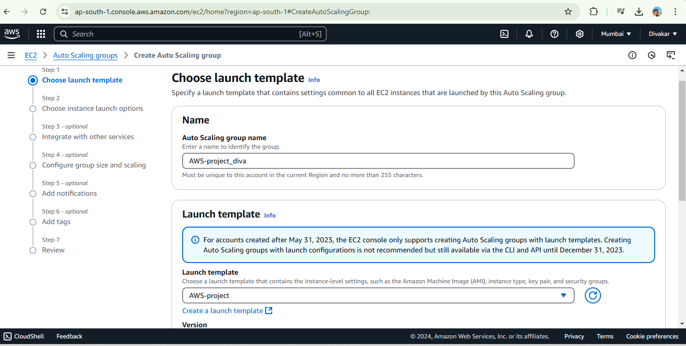
    b.	Choose the VPC where your instances will run. 
    c.	Select private subnets in the VPC (preferably across multiple Availability Zones for high availability). 
    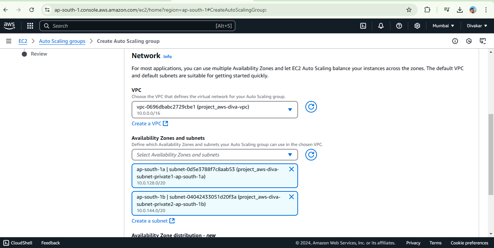
8.	Define Scaling Parameters: 
    a.	Minimum Capacity: Set the minimum number of instances (e.g., 2). 
    b.	Maximum Capacity: Set the maximum number of instances (e.g., 4). 
    c.	Desired Capacity: Set the initial number of instances (e.g., 2). 
9.	Finalize the Auto Scaling Group: 
    a.	Review your configuration and make any necessary adjustments. 
    b.	Click Create Auto Scaling Group to complete the setup. 
    
## step 3: Create an instance
1.	Navigate to Services > EC2 from the top menu. 
2.	Click on Instances from the left-hand menu, then click on the Launch Instances button to start creating a new instance. 
3.	Choose an Amazon Machine Image (AMI): 

4.	Select an AMI based on your requirements. For example: 
    a.	Use Ubuntu AMI for general-purpose workloads. 
    b.	Pick a pre-configured AMI if your application requires specific software. 
    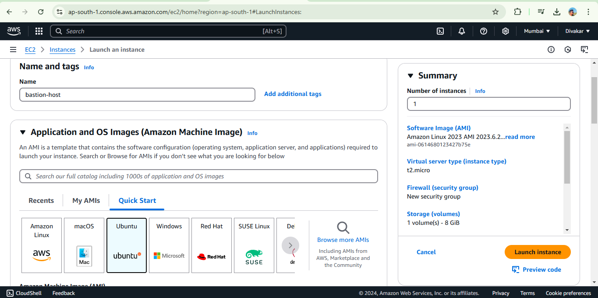
5.	Select an Instance Type: 
6.	Choose an instance type that matches your performance and cost requirements. For example: 
    a.	t2.micro is suitable for lightweight workloads and is free-tier eligible. 
    b.	For larger workloads, select an instance type with more CPU or memory. 
7.	Configure the Network Settings: 
8.	Under Network settings, choose the VPC you want the instance to be part of. 
9.	Select a public subnet within your VPC. 
10.	Enable Auto-assign Public IP to ensure your instance can be accessed from the internet. 

11.	Assign a Security Group: 
12.	Select an existing Security Group or create a new one. 
13.	Ensure the following rules are added: 
    a.	Inbound Rules: 
        i.	SSH (Protocol: TCP, Port: 22, Source: Anywhere or your IP address). 
        ii.	HTTP (Protocol: TCP, Port: 80, Source: Anywhere) if you're hosting a website. 
14.	Review and Launch the Instance: 
15.	Carefully review all configurations, including the AMI, instance type, storage, and network. 
16.	Click Launch and select a Key Pair for SSH access. If you don’t have one, create a new key pair and download it. 
17.	Verify the Instance: 
18.	Once the instance is launched, go to the Instances section in the EC2 dashboard. 
19.	Check that the instance state is Running and verify the Public IP Address. 
20.	Use this IP address to connect to your instance via SSH or test accessibility 

## Step 4: Create a load balancer

1.	Access the EC2 Dashboard: 
    a.	Log in to the AWS Management Console. 
    b.	Navigate to Services > EC2. 
    c.	In the left-hand menu, select Load Balancers under the Load Balancing section. 
2.	Create a Load Balancer: 
    a.	Click on the Create Load Balancer button. 
    b.	Choose Application Load Balancer (ALB) for HTTP/HTTPS traffic distribution. 
3.	Configure the Load Balancer Settings: 
    a.	Provide a name for your Load Balancer in the Name field. 
    b.	Set the Scheme to Internet-facing to allow external traffic. 
    
    c.	Choose IP Address Type as IPv4. 
    d.	Under Network mapping, select the VPC you created earlier. 
4.	Enable Availability Zones: 
    a.	Activate at least 2 Availability Zones for high availability. 
    b.	Select Public Subnets for each Availability Zone where your instances are deployed. 
     
5.	Configure the Security Group: 
    a.	Assign a Security Group that allows traffic to your Load Balancer. 
    b.	For example, ensure the following rules are added to the Security Group: 
        i.	HTTP (TCP, Port 80, Source: Anywhere). 
        ii.	HTTPS (TCP, Port 443, Source: Anywhere), if using SSL. 
6.	Security Settings (Optional): 
    a.	If you're using HTTPS, configure the SSL Certificate here. Otherwise, skip this step. 
7.	Configure Routing Settings: 
    a.	Under Routing, create a new Target Group by clicking Create a new target group. 
8.	Create a Target Group: 
    a.	Enter a name for your Target Group. 
    b.	Set the Target Type to Instances to distribute traffic among EC2 instances. 
    
    c.	Select the VPC where your instances are deployed. 
    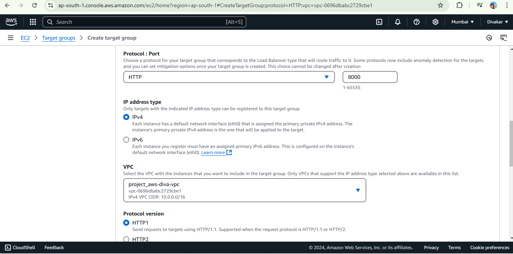
    d.	Configure Health Check Settings: 
        i.	Protocol: Choose HTTP or HTTPS. 
        ii.	Path: Specify the health check path (e.g., /index.html). 
9.	Register Targets: 
    a.	Add the EC2 instances to the Target Group by selecting them. 
    b.	Click Include as targets to associate the instances. 
     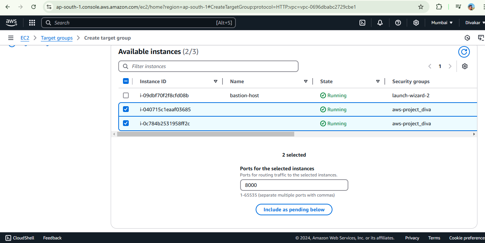
    c.	Proceed by clicking Next: Review. 
10.	Review and Create the Target Group: 
    a.	Verify the settings and click Create target group to finalize. 
11.	Add the Target Group to the Load Balancer: 
    a.	After creating the Target Group, go back to the Load Balancer configuration. 
    b.	Select the Target Group you created and associate it with the Load Balancer. 
12.	Review and Create the Load Balancer: 
    a.	Double-check all the settings, including availability zones, security groups, and the associated Target Group. 
    b.	Click Create Load Balancer to complete the setup. 

## Step 5: SSH into Private Instance via Bastion Host and Deploy Application

Step 1: SSH into the Bastion Host 
1.	Ensure the PEM file is accessible: 
    a.	Verify that your .pem file (key pair) is present on your local machine. 
    b.	Rename the file if necessary to avoid spaces in the name (e.g., aws_vpc.pem instead of aws vpc.pem). 
2.	Copy the PEM file to the Bastion Host: 
    a.	Use the scp command to transfer the .pem file to the Bastion host. 
    b.	Replace <local file path> with the location of the PEM file on your local machine, and <bastion public IP> with your Bastion Host's public IP. 
        scp -i C:\Users\Lenovo_Admin\Downloads\aws-vpc.pem C:\Users\Lenovo_Admin\Downloads\aws-vpc.pem ubuntu@13.233.106.134:/home/ubuntu
         
        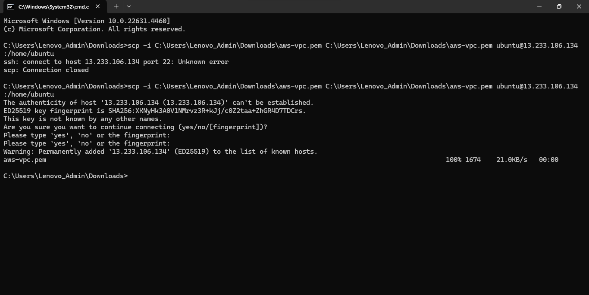 
3.	SSH into the Bastion Host: 
    a.	Use the ssh command with the Bastion Host's public IP to log in. 
    ssh -i aws-vpc.pem ubuntu@13.233.106.134
     
     
4.	Set permissions for the PEM file: 
    a.	On the Bastion Host, ensure the .pem file has proper permissions. Use: 
    chmod 400 aws-vpc.pem
________________________________________
Step 2: SSH into the Private Instance 
1.	Log into the Private Instance from the Bastion Host: 
    a.	Use the Private Instance's private IP address to SSH into it: 
    ssh -i aws-vpc.pem ubuntu@10.0.133.85
2.	Verify Connectivity: 
    a.	Run ls on the Bastion Host to confirm the presence of the PEM file before attempting to SSH into the private instance. 
      
    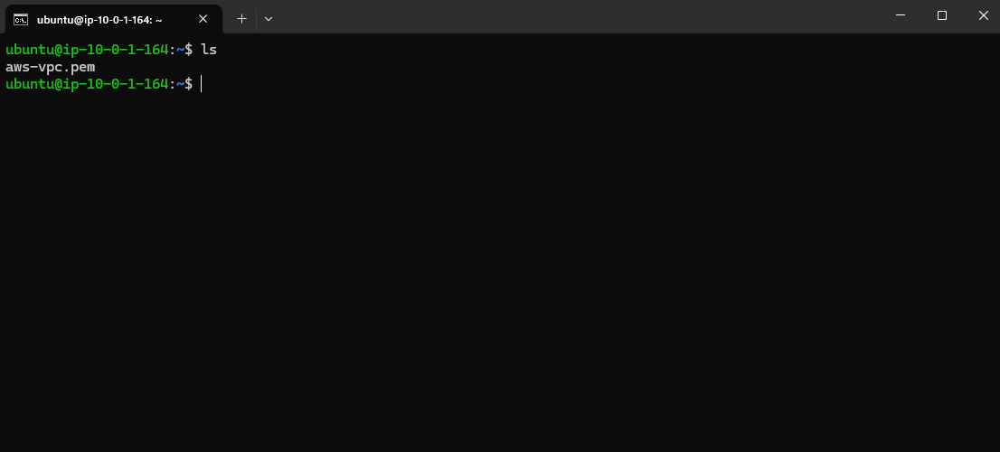 
________________________________________
Step 3: Deploy the Application on the Private Instance 
1.	Create an HTML File: 
    a.	Use the Vim editor to create a simple HTML file: 
    vim index.html
2.	Add the Following HTML Content: 
    a.	Insert the content below into the file: 
        html
       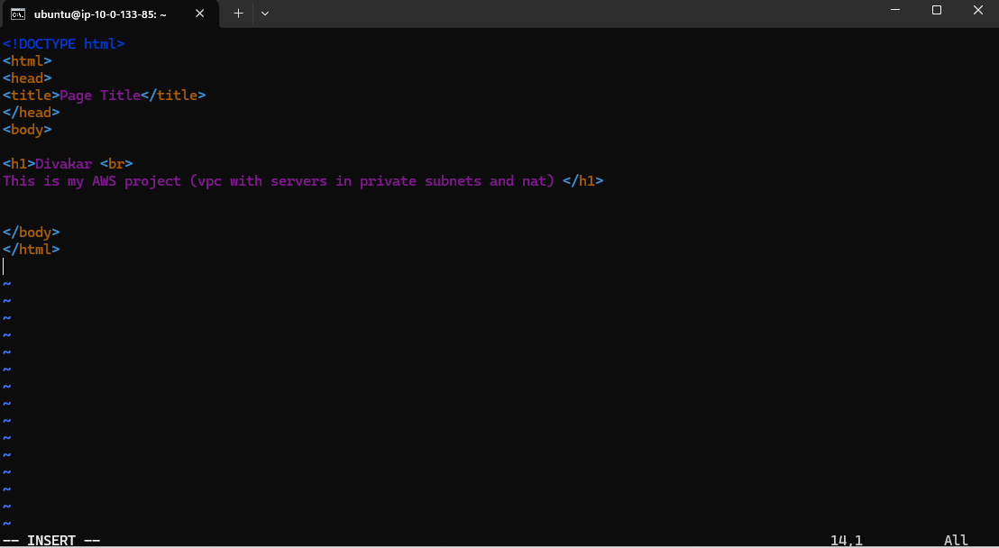
3.	Save the HTML File: 
    a.	Press Esc, type :wq, and hit Enter to save and exit Vim. 
4.	Start a Python HTTP Server: 
    a.	Use the following command to start a simple HTTP server on port 8000: 
    python3 -m http.server 8000
      
    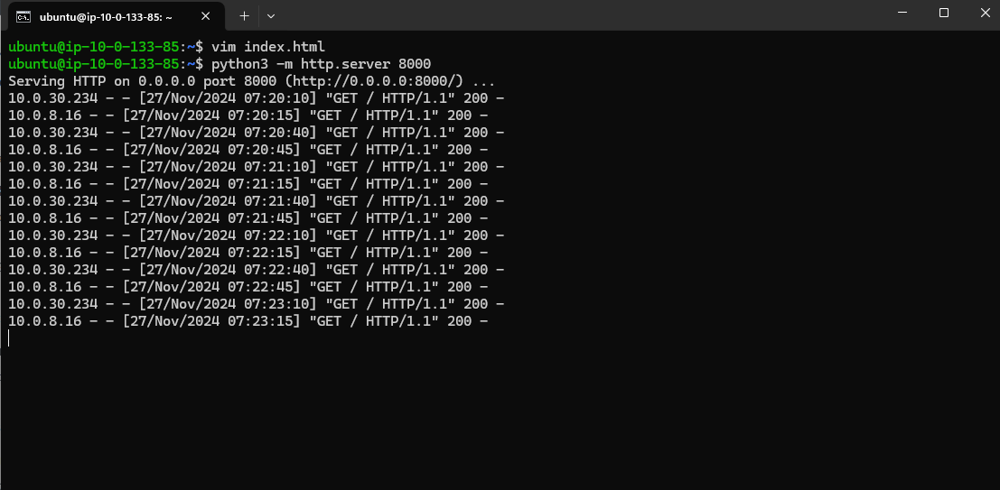 
5.	Verify Deployment: 
a.	The application will now be available on the private instance at port 8000. 
 
6.  Go to load balancer,copy the DNS of the load balancer you created and run it on the browser 
   
    copy the DNS name of load balancer
     
    
     

## Step 6: RESULT
img result 
    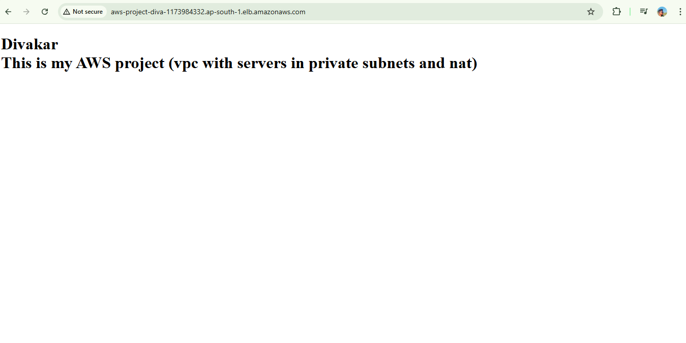 

Now we have successfully deployed the application securely on the private instance. The application can be accessed over the internet using the Load Balancer, ensuring secure and efficient traffic distribution.
