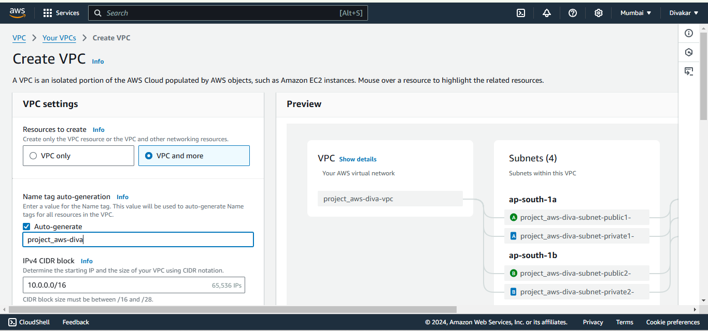

# VPC with servers in private subnets and NAT
## Overview :
In this project, a Virtual Private Cloud (VPC) is designed and implemented on AWS to create a secure and scalable environment for hosting web applications and services. The VPC is segmented into public and private subnets, with specific routing configurations that allow secure communication between the components and the internet.

Step 1: Create the VPC
1.	Open the Amazon VPC Console: 
    a.	Visit Amazon VPC Console. 
2.	Create a New VPC: 
    a.	On the dashboard, click Create VPC. 
    b.	Under Resources to create, select VPC and more. 

    
3.	Configure the VPC: 
    a.	Provide a name for the VPC in the Name tag auto-generation field. 
    b.	For the IPv4 CIDR block, leave it as the default suggestion (e.g., 10.0.0.0/16). 
4.	Configure Subnets: 
    a.	Set the Number of Availability Zones to 2 for higher availability. 
    b.	Specify the Number of public subnets as 2. 
    c.	Specify the Number of private subnets as 2. 
    d.	For NAT gateways, choose 1 per AZ to ensure high resiliency. 
    e.	Leave VPC endpoints as None unless required. 
    
    f.	For DNS options, ensure the checkbox for Enable DNS hostnames is unchecked. 
5.	Create the VPC: 
    a.	Once you’ve configured all the settings, click Create VPC. 
    
